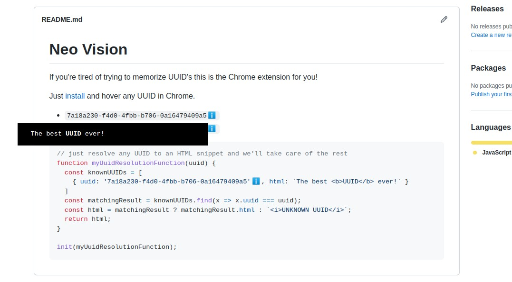

# UUIDs Annotation DEMO (Chrome Extension)

Are you tired of trying to memorize UUID's? Then this is the Chrome extension for you!

Just [install](https://developer.chrome.com/docs/extensions/mv3/getstarted/development-basics/#load-unpacked), and hover over any UUID.

- `7a18a230-f4d0-4fbb-b706-0a16479409a5`
- `e149f586-0376-4a5b-9955-ffad5b139d02`

```javascript
// just resolve any UUID to an HTML snippet and we'll take care of the rest
function myUuidResolutionFunction(uuid) {
  const knownUUIDs = [
    { uuid: '7a18a230-f4d0-4fbb-b706-0a16479409a5', html: `The best <b>UUID</b> ever!` }
  ]
  const matchingResult = knownUUIDs.find(x => x.uuid === uuid);
  const html = matchingResult ? matchingResult.html : `<i>UNKNOWN UUID</i>`;
  return html;
}

init(myUuidResolutionFunction);
```



## More

- [Blog post](https://fghibellini.com/posts/2022-12-17-Leveraging-UUIDs-to-the-Max/index.html) with a deeper explanation.
